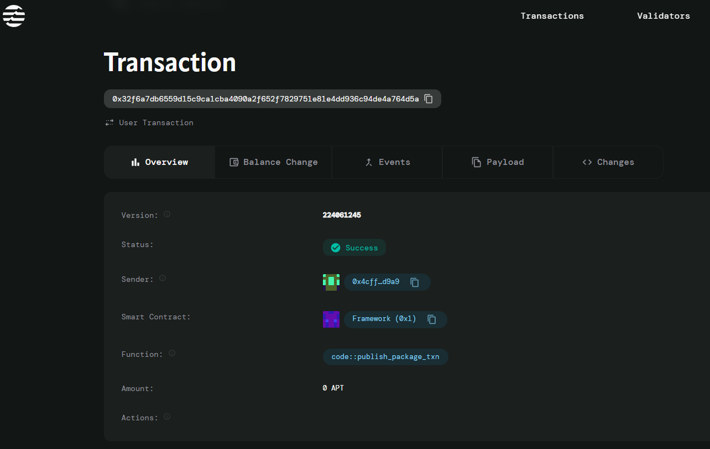

# Blockchain Badge System – NFTs for Academic Milestones

## Project Description

The Blockchain Badge System is a decentralized application built on the Aptos blockchain that enables educational institutions, organizations, and certified issuers to create and distribute digital badges as NFTs (Non-Fungible Tokens) to recognize academic achievements and milestones. This system provides a transparent, verifiable, and tamper-proof way to acknowledge student accomplishments, certifications, and educational progress.

Unlike traditional paper certificates that can be lost or forged, these blockchain-based badges offer permanent, cryptographically secure proof of achievement that can be easily verified by employers, other institutions, or any third party. Each badge contains metadata about the achievement, issuer, recipient, and timestamp, creating an immutable record of academic success.

## Project Vision

Our vision is to revolutionize the way academic achievements are recognized and verified by creating a global, interoperable system where:

- **Students** can build a comprehensive, portable digital portfolio of their academic achievements
- **Institutions** can issue verifiable credentials that enhance their reputation and provide value to graduates  
- **Employers** can instantly verify candidate qualifications without lengthy verification processes
- **Society** benefits from reduced credential fraud and improved trust in educational achievements

We envision a future where academic credentials are universally accessible, instantly verifiable, and owned by the students themselves, creating a more transparent and efficient educational ecosystem.

## Key Features

### 🎓 **Digital Badge Minting**
- Educational institutions can mint unique NFT badges for various academic achievements
- Each badge contains comprehensive metadata including title, recipient, issuer, and timestamp
- Automated badge ID generation ensures uniqueness and prevents duplication

### 👤 **Personal Badge Collections**
- Students maintain their own collection of earned badges in a secure digital wallet
- Easy initialization system for new users joining the platform
- Complete ownership and control over personal achievement records

### 🔐 **Immutable Verification**
- All badges are permanently recorded on the Aptos blockchain
- Cryptographic security prevents tampering or forgery
- Instant verification capabilities for third parties

### 🏛️ **Multi-Institutional Support**
- Support for multiple educational institutions and certification bodies
- Decentralized issuing system allows any verified institution to participate
- Cross-institutional recognition and interoperability

### 📊 **Transparent Achievement Tracking**
- Public verifiability while maintaining privacy where needed
- Comprehensive audit trail for all issued badges
- Real-time achievement portfolio management

## Future Scope

### Phase 2 Enhancements
- **Smart Verification Contracts**: Implement automated verification workflows for employers
- **Badge Metadata Expansion**: Add support for detailed course information, grades, and skill assessments
- **Reputation Scoring**: Develop issuer reputation systems to rank institutional credibility

### Phase 3 Advanced Features
- **Cross-Chain Compatibility**: Extend support to other blockchain networks for broader adoption
- **AI-Powered Achievement Analytics**: Implement machine learning for skill gap analysis and career recommendations
- **Marketplace Integration**: Create a marketplace for badge-gated opportunities and exclusive content

### Long-term Vision
- **Global Education Passport**: Establish the system as a universal academic credential standard
- **Micro-Credential Ecosystem**: Support for granular skill-based certifications and continuous learning
- **Integration with Professional Networks**: Direct integration with LinkedIn, job boards, and recruitment platforms

## Contract Details
0x32f6a7db6559d15c9ca1cba4090a2f652f7829751e81e4dd936c94de4a764d5a

